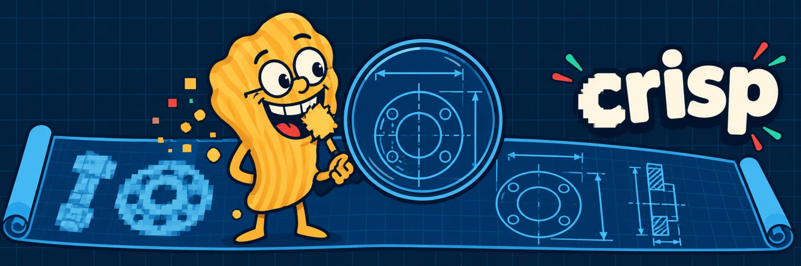
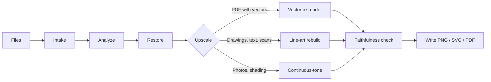

<p align="center">
  
</p>

<p align="center">
  <a href="#quick-start"></a>
  <a href="LICENSE"></a>
  <a href="#roadmap"></a>
  <a href="#how-it-works"></a>
  <a href="https://github.com/DeanT-04/crisp/actions/workflows/ci.yml"></a>
</p>

<p align="center">
  <b>English</b>
</p>

---

**crisp** is a free, open-source tool being built to make blurry images bigger and sharper without AI. It targets technical drawings, scans and documents first: the images where dimensions and notes turn to mush when you zoom in. It will run on your own machine, take one file or a whole folder, and never add detail that isn't in the source.

> **Why "crisp"?** Because a blurry drawing should come out crisp. And because a crisp (a potato chip, if you're American) is a snack made of nothing but sharp edges. The mascot crunches blurry pixels so you don't have to squint at them.

> [!NOTE]
> **Status: v0.1 — foundation: CLI and benchmark work; output is not yet sharper than standard resizing.** The command line, folder and PDF handling, and the benchmark harness are built and tested. Only the baseline engine exists (Lanczos resampling in linear light), so a 4× result looks like any other resizer's. The line-art engine that is meant to beat it is milestone M2, and the benchmark is how we will show whether it does. Design: [`docs/superpowers/specs/2026-10-04-crisp-design.md`](docs/superpowers/specs/2026-10-04-crisp-design.md).

## What it is meant to do

- **Rebuild drawings instead of stretching them.** It measures the blur from the drawing's own straight edges, undoes it, and redraws lines and text at the new size.
- **Re-render PDFs exactly.** If a PDF still holds its original vector lines, crisp redraws them at any resolution with no guessing.
- **Clean up scans and JPEGs first.** It straightens crooked scans, evens out lighting and removes JPEG blocks, so the damage isn't enlarged along with the drawing.
- **Batch whole folders.** One file or thousands, spread across CPU cores. A broken file is skipped and reported, never fatal.
- **Check its own work.** Every result is shrunk back down and compared with the original. If they don't match, crisp falls back to a safe method and tells you.

## Features

<table>
  <tr>
    <td width="33%" valign="top">
      <h3>Vector PDF re-render</h3>
      PDFs exported from CAD often still contain their vector lines. crisp detects that and redraws the page at the resolution you ask for.<br><br><sub><b>Available</b></sub>
    </td>
    <td width="33%" valign="top">
      <h3>Line-art rebuild</h3>
      Blur measurement, deblurring, sub-pixel edge redrawing, line and arc straightening, and protection for faint strokes and small text.<br><br><sub><b>Planned · P1</b></sub>
    </td>
    <td width="33%" valign="top">
      <h3>Batch CLI</h3>
      Point it at files or folders and pick a scale, a DPI, or a paper size. Originals are never overwritten.<br><br><sub><b>Available</b></sub>
    </td>
  </tr>
  <tr>
    <td width="33%" valign="top">
      <h3>Benchmark report</h3>
      Scores crisp against bicubic, Lanczos and a leading AI upscaler on text legibility, edge accuracy, PSNR, SSIM and speed.<br><br><sub><b>Available · AI comparator optional, text legibility needs Tesseract</b></sub>
    </td>
    <td width="33%" valign="top">
      <h3>Faithfulness check</h3>
      Each output, shrunk back down, must match the input. Anything that fails is redone with the safe engine and flagged.<br><br><sub><b>Planned · P1</b></sub>
    </td>
    <td width="33%" valign="top">
      <h3>Scan and JPEG clean-up</h3>
      Deskew, lighting correction, denoising and JPEG deblocking, applied only when the image needs them.<br><br><sub><b>Planned · P2</b></sub>
    </td>
  </tr>
  <tr>
    <td width="33%" valign="top">
      <h3>Photo fallback</h3>
      Edge-directed interpolation plus a consistency check for photos and shaded areas. Better than standard resizing; not tuned to compete with AI on photos.<br><br><sub><b>Planned · P2</b></sub>
    </td>
    <td width="33%" valign="top">
      <h3>SVG / PDF export</h3>
      Optional vector output for clean line art, so the result stays sharp at any zoom.<br><br><sub><b>Planned · P3</b></sub>
    </td>
    <td width="33%" valign="top">
      <h3>Desktop app</h3>
      Drag-and-drop app on top of the same engine. A separate project after v1, followed by an MCP server.<br><br><sub><b>Planned · after v1</b></sub>
    </td>
  </tr>
</table>

## Quick start

**You need:** [Python 3.12+](https://www.python.org/downloads/) and [uv](https://docs.astral.sh/uv/). The benchmark's text-legibility score also needs [Tesseract](https://github.com/tesseract-ocr/tesseract); without it that column shows N/A.

```bash
# 1. Install the command
uv tool install git+https://github.com/DeanT-04/crisp

# 2. Upscale one drawing 4x (writes drawing@4x.png next to the original)
crisp drawing.png --scale 4

# 3. Upscale a whole folder into another folder
crisp ./scans/ --scale 4 --out ./sharp/

# 4. Re-render a CAD PDF at 600 DPI, or fit an image to A3 at 300 DPI
crisp plan.pdf --dpi 600
crisp drawing.png --size A3@300

# 5. Run the benchmark and open the report (from a clone of this repo)
crisp bench --quick
```

Folders are scanned one level deep; add `--recursive` to go further. crisp never overwrites a source file and skips outputs that already exist unless you pass `--overwrite`. SVG/PDF output (`--vector`) is planned, not built.

## How it works



<details>
<summary>Why no AI?</summary>

AI upscalers produce convincing detail by guessing it. On an engineering drawing, a convincing guess can be a wrong number. crisp only sharpens and rebuilds what is actually in the image. AI tools appear in this project only as a benchmark to measure against.

</details>

<details>
<summary>What crisp can't do</summary>

No algorithm can bring back information the image no longer holds. Text that was about 5 pixels tall, with its strokes fully merged by blur, can't be reliably recovered. crisp will sharpen it as far as the data allows, and the benchmark will publish where that limit is.

</details>

## Roadmap

- [x] Design spec
- [x] M1 — Foundation: intake, PDF re-render, write, batch CLI, baseline engine, benchmark harness
- [ ] M2 — Line-art engine, content analysis, faithfulness check with fallback
- [ ] M3 — Restore stage: JPEG deblocking, denoise, deskew, lighting
- [ ] M4 — Continuous-tone engine, mixed-region routing, tiling for huge images
- [ ] M5 — SVG/PDF export, speed work, v1.0 release
- [ ] Desktop app (separate project)
- [ ] MCP server (separate project)

## License

[MIT](LICENSE) © 2026 DeanT-04
